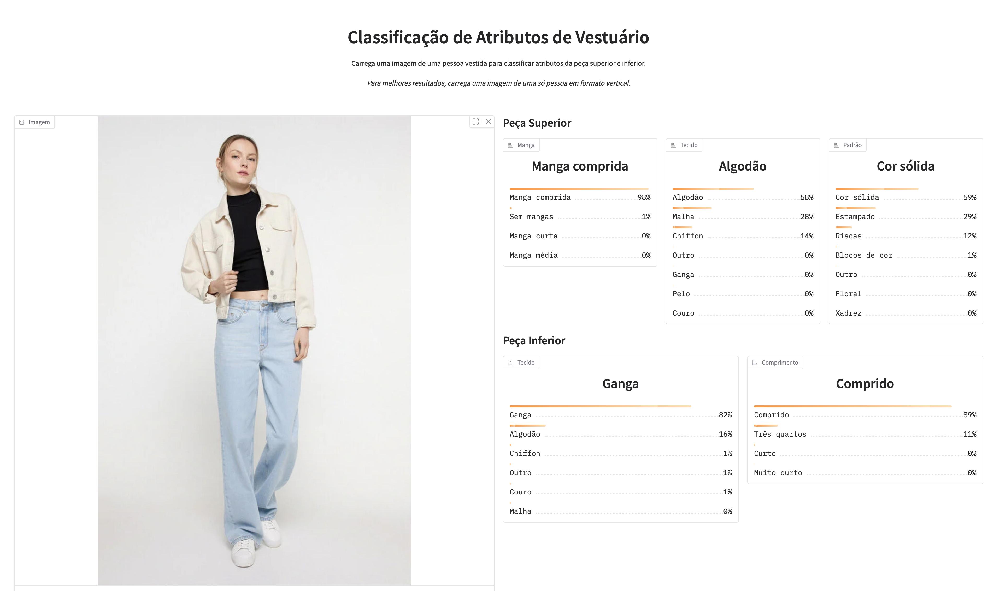

# Garment Attribute Classification
Projeto desenvolvido no âmbito da unidade curricular de **AOOP II** (2026).

## Descrição
Este projeto tem como objetivo a classificação de atributos de peças de roupa a partir de imagens, utilizando técnicas de visão computacional e deep learning.

O sistema utiliza dois modelos independentes para classificar em simultâneo os seguintes atributos:

**Peça Superior**
- Comprimento da manga (sem mangas, manga curta, manga média, manga comprida)
- Tipo de tecido (ganga, algodão, couro, pelo, malha, chiffon, outro)
- Padrão de cor (floral, estampado, riscas, cor sólida, xadrez, outro, blocos de cor)

**Peça Inferior**
- Tipo de tecido (ganga, algodão, couro, malha, chiffon, outro)
- Comprimento (muito curto, curto, três quartos, comprido)

## Demonstração




A pasta src/ contém uma aplicação Gradio que permite carregar uma imagem e obter as previsões do modelo em tempo real.

```bash
cd src
python app.py
```

## Objetivos
- Desenvolver um modelo de visão computacional para classificação de vestuário
- Aplicar técnicas de deep learning com Transfer Learning
- Avaliar e melhorar iterativamente o desempenho do modelo
- Disponibilizar uma demonstração interativa do modelo treinado

## Dataset
Este projeto utiliza o dataset **DeepFashion-MultiModal**.
O dataset contém imagens de pessoas vestidas com anotações manuais de atributos de vestuário.
Disponível em: [github.com/yumingj/DeepFashion-MultiModal](https://github.com/yumingj/DeepFashion-MultiModal)

## Ambiente de Desenvolvimento
Devido à dimensão do dataset, o desenvolvimento foi realizado utilizando **Kaggle Notebooks**, permitindo acesso direto aos dados sem necessidade de download local.

## Tecnologias
- Python
- PyTorch e Torchvision (EfficientNet-B0)
- Gradio
- Pandas, NumPy, Matplotlib, Seaborn, Scikit-learn
- Kaggle Notebooks (GPU Tesla T4)

## Estado atual
| Notebook | Descrição | Estado |
|---|---|---|
| 01 — Exploration | Análise exploratória do dataset | Completo |
| 02 — Data Preparation | Limpeza, splits e pré-processamento | Completo |
| 03 — Model Training v1 | Treino inicial — weighted cross-entropy, 20 épocas | Completo |
| 04 — Evaluation | Avaliação do modelo v1 no conjunto de teste | Completo |
| 05 — Conclusions | Análise de erros e melhorias propostas | Completo |
| 06 — Model Training v2 | Focal loss, remoção de classe problemática, 30 épocas — **modelo upper atual** | Completo |
| 07 — Optimized Training | Focal loss + undersampling + early stopping — modelo v3 | Completo |
| 08 — Segmented Data Preparation | Preparação de dados com máscaras de segmentação | Completo |
| 09 — Lower Model Training | Treino do modelo para peça inferior com imagens completas — **modelo lower atual** | Completo |
## Autor
- **Nome:** Miguel Miranda Rebouço
- **Turma:** B
- **Email:** mir@ipvc.pt